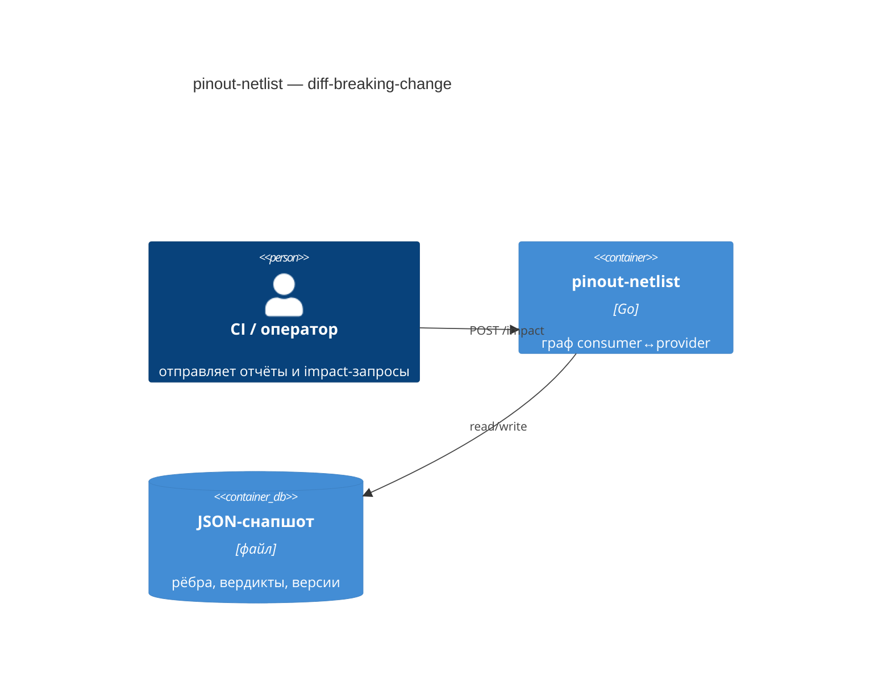
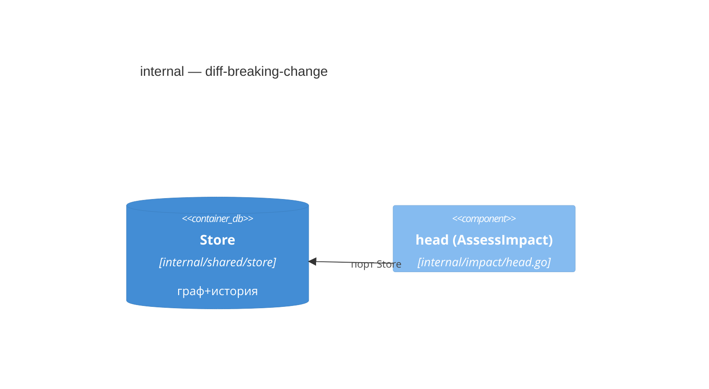

# c4 — slice-03-diff-breaking-change

## C2 (контейнеры)

```mermaid
C4Container
  title pinout-netlist — diff-breaking-change
  Person(ci, "CI / оператор", "отправляет отчёты и impact-запросы")
  Container(netlist, "pinout-netlist", "Go", "граф consumer↔provider")
  ContainerDb(store, "JSON-снапшот", "файл", "рёбра, вердикты, версии")
  Rel(ci, netlist, "POST /impact")
  Rel(netlist, store, "read/write")
```

## C3 (компоненты = дерево module-tree)

```mermaid
C4Component
  title internal — diff-breaking-change
  ContainerDb(s, "Store", "internal/shared/store", "граф+история")
  Component(h, "head (AssessImpact)", "internal/impact/head.go")
  Rel(h, s, "порт Store")
```

C3 нода-в-ноду совпадает с `module-tree.md`.
